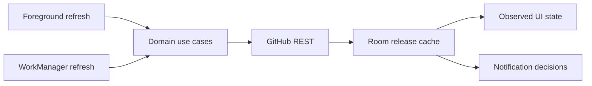

# AppScout

**Understand whether an installed Android app has a newer GitHub release, and what changed, without losing the last-known answer offline.**

For apps installed outside a managed store, checking updates often means finding the right repository, comparing an installed version with a release tag and reading unfamiliar release notes. A newer-looking tag alone does not explain whether a change deserves attention—and some version formats cannot be compared safely.

AppScout links a selected launcher app to a GitHub repository, caches release information and exposes both the version decision and its uncertainty. Optional AI summaries help interpret the notes; the official release remains available for review. The app does not download or install updates.

## The update-review workflow

1. Select an installed launcher app and attach its GitHub repository.
2. Refresh to compare the installed version with the published release.
3. Read release details, or request a clearly labelled Gemini summary using your own key.
4. Open the official release in the browser to decide what to do.
5. Return offline: cached details remain readable, with failed checks marked stale.

## A useful answer includes uncertainty

| Situation | Implemented behavior |
|---|---|
| Versions parse successfully | Compare numeric components and prerelease identifiers |
| Either version cannot be parsed | Report `VERSION_COMPARISON_UNCERTAIN` |
| A refresh fails | Preserve cached information and mark the decision stale |
| GitHub returns HTTP 304 | Reuse the cached release through ETag revalidation |
| Latest-release lookup cannot provide an eligible release | Fall back to the release list and filter drafts/prereleases |
| A release was already notified | Deduplicate notifications by release tag |

This separation matters: “no update,” “could not compare” and “could not refresh” are different answers. See the [version comparator](app/src/main/java/com/noise/appscout/domain/version/VersionComparator.kt), [status resolver](app/src/main/java/com/noise/appscout/domain/release/ReleaseStatusResolver.kt) and [GitHub boundary](app/src/main/java/com/noise/appscout/data/remote/github/GitHubReleaseDataSource.kt).

## One cache, two refresh paths



Compose screens observe local state rather than rendering network responses directly. Room persists tracked sources and releases; DataStore holds settings. WorkManager submits unique, network-constrained periodic work with a 12-hour interval and `KEEP` policy. Android controls actual execution time. Shared use cases keep foreground and background refresh behavior aligned.

Details: [architecture](docs/architecture.md) · [decisions](docs/decisions/).

## Optional AI: advisory, with bounded validation

Gemini receives the app name and supplied release text when summaries are requested. Output is parsed as structured JSON, bounded in size and mapped to explicit failure states. A keyword check removes unsupported security-related reasons and clears the security flag when the notes lack matching terms.

That check is a heuristic, **not semantic verification**: it does not prove the summary is accurate, and the summary text itself is retained. Readers should consult the original release notes. The provider and model identifier are configured in [GeminiAiSummaryProvider](app/src/main/java/com/noise/appscout/data/remote/gemini/GeminiAiSummaryProvider.kt); service/model availability is a runtime dependency.

The key is encrypted using Android Keystore-backed storage. Core tracking requires no Gemini key. There is no application backend or analytics integration; GitHub checks and optional Gemini requests use network services.

## Run and verify

Use Android Studio and the versions declared in the Gradle files:

```bash
./gradlew lint test assembleDebug
```

Existing JVM tests cover URL parsing, HTTP/cache responses, version uncertainty, notification deduplication, scheduling and AI output validation. [The instrumented acceptance test](app/src/androidTest/java/com/noise/appscout/TrackRealRepositoryTest.kt) needs a device and access to a public repository. Test presence is not a claim that those checks were rerun during this documentation pass.

Existing [home-screen capture](phase2_home.png) shows the empty initial state; it does not demonstrate release comparison. A populated release-detail screenshot or end-to-end recording remains a presentation gap.

## Scope and limits

Launcher apps must be linked manually to repositories. Arbitrary download sites, automatic installation and a complete release-history browser are outside this workflow. Unusual version schemes remain uncertain; cached information can be outdated; prerelease inclusion does not guarantee discovery of the newest prerelease when the latest-release endpoint already returns an eligible stable release.

MIT licensed: [LICENSE](LICENSE). Dependency notices: [THIRD_PARTY_NOTICES](THIRD_PARTY_NOTICES.md).
